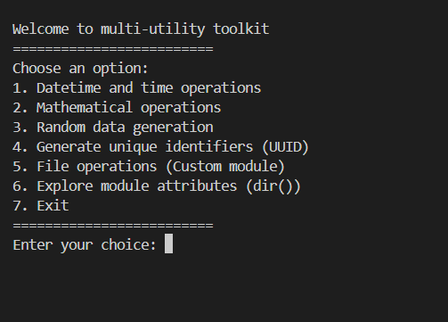
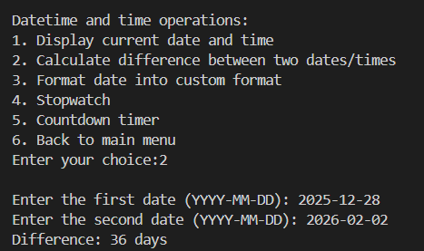
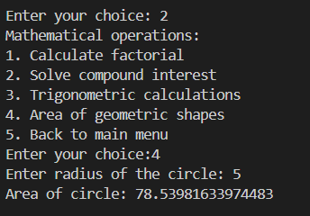
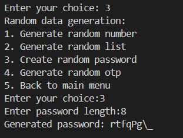
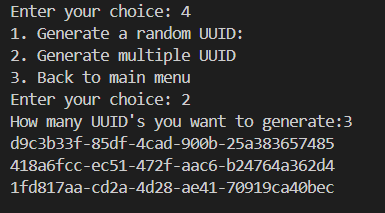
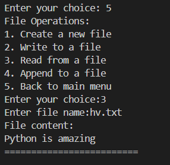
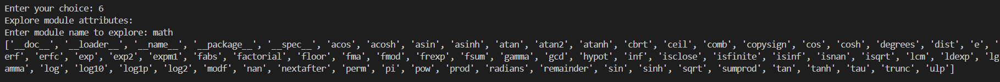

<div align="center">


<br/>

[](https://python.org)
[](LICENSE)
[](https://github.com/HarshalVora86/Moduler-Packager)
[](https://github.com/HarshalVora86/Moduler-Packager/issues)

<br/>

> **A powerful, menu-driven Python toolkit** that bundles datetime handling, math operations, random data generation, UUID creation, and custom file I/O — all in one clean, modular package. 🎯

<br/>


</div>

---

## 📖 Table of Contents

- [⚡ What It Does](#-what-it-does)
- [🗂️ Project Structure](#️-project-structure)
- [🚀 Getting Started](#-getting-started)
- [🛠️ Modules Overview](#️-modules-overview)
- [📸 Screenshots](#-screenshots)
- [📌 Key Concepts Used](#-key-concepts-used)
- [🤝 Contributing](#-contributing)

---

## ⚡ What It Does

<div align="center">


_•_\_\_import\_\_()_Dynamic_Load-EAF3DE?style=for-the-badge&labelColor=3B6D11&color=EAF3DE)

</div>

## 🗂️ Project Structure

```
Moduler-Packager/
│
├── 📄 PR_7.py               # Main entry point — interactive menu system
├── 📦 file_operations.py    # Custom module for file I/O operations
└── 📘 README.md             # You're reading it!
```

---

## 🚀 Getting Started

### Prerequisites

- Python **3.10+** (uses `match`/`case` syntax)
- No external libraries needed — pure standard library! 🎉

### Installation

```bash
# 1. Clone the repository
git clone https://github.com/HarshalVora86/Moduler-Packager.git

# 2. Navigate to the project folder
cd Moduler-Packager

# 3. Run the toolkit
python PR_7.py
```

> ✅ That's it! No `pip install` needed.

---

## 🛠️ Modules Overview

### 🔵 `PR_7.py` — Main Controller

The brain of the toolkit. Uses Python's **`match`/`case`** (structural pattern matching) to route user choices to the right sub-menu.

```python
match choice:
    case 1: # Datetime operations
    case 2: # Math operations
    case 3: # Random data generation
    case 4: # UUID generation
    case 5: # File operations
    case 6: # Module explorer
    case 7: # Exit
```

**Standard libraries used:**
`math` · `datetime` · `time` · `random` · `string` · `uuid`

---

### 🟢 `file_operations.py` — Custom Module

A hand-crafted Python module demonstrating **modular programming** and clean separation of concerns.

```python
import file_operations

file_operations.create_file("notes.txt")
file_operations.write_file("notes.txt", "Hello, World!")
file_operations.read_file("notes.txt")
file_operations.append_file("notes.txt", "\nMore data")
```

| Function | Description |
|----------|-------------|
| `create_file(filename)` | Creates an empty file |
| `write_file(filename, data)` | Writes (overwrites) content to a file |
| `read_file(filename)` | Reads and prints file content |
| `append_file(filename, data)` | Appends data without overwriting |

---

## 📸 Screenshots

<div align="center">

**🏠 Main Menu**



**📅 Datetime Operations — Date Difference**



**➗ Math — Area of Circle**



**🎲 Random Password Generator**



**🔑 UUID Bulk Generator**



**📁 File Operations — Read File**



**🔍 Module Explorer (dir())**



</div>

---

## 📌 Key Concepts Used

```python
✅ Modular Programming       — Custom module (file_operations.py)
✅ match / case              — Python 3.10+ structural pattern matching
✅ Standard Library Mastery  — math, datetime, time, random, string, uuid
✅ File Handling             — read, write, append, create
✅ OOP-style Design          — Clean separation of concerns
✅ Real-time I/O             — Stopwatch & countdown timer with time.sleep()
✅ Module Introspection      — dir() + __import__() for dynamic exploration
```

---

## 🤝 Contributing

Contributions, ideas, and bug reports are welcome! 🙌

```bash
# Fork → Clone → Create Branch → Commit → Push → Pull Request
git checkout -b feature/your-feature-name
git commit -m "✨ Add: your feature description"
git push origin feature/your-feature-name
```

---

<div align="center">

⭐ **If you found this useful, drop a star on the repo!** ⭐


*Built with ❤️ and Python*


</div>
